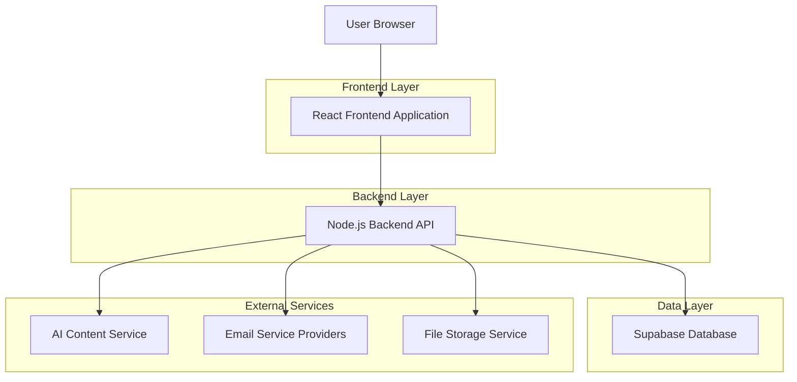
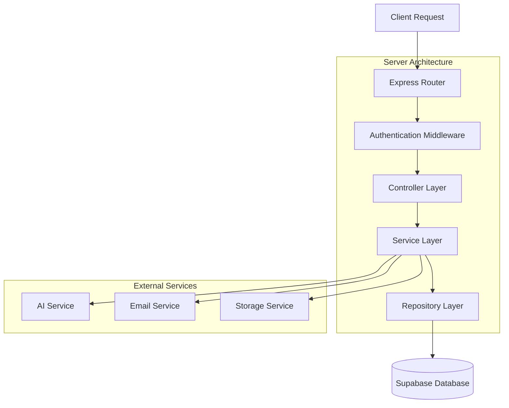
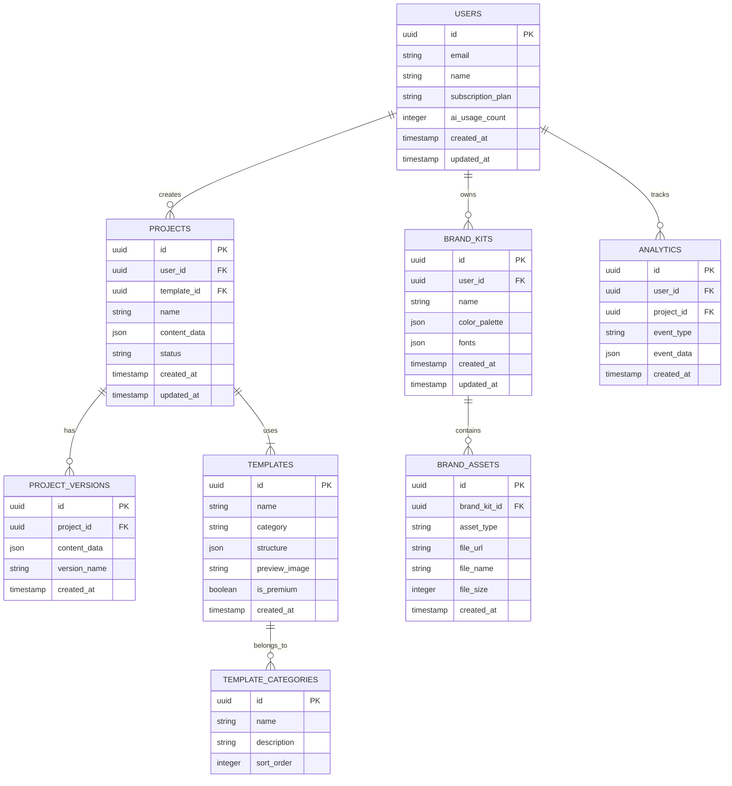

# Newsletter Creator Platform - Technical Architecture Document

## 1. Architecture Design



## 2. Technology Description
- Frontend: React@18 + TypeScript + Tailwind CSS@3 + Vite + React DnD
- Backend: Node.js@18 + Express@4 + TypeScript
- Database: Supabase (PostgreSQL)
- Authentication: Supabase Auth
- File Storage: Supabase Storage
- AI Service: OpenAI GPT-4 API
- Email Services: SendGrid, Mailchimp, Constant Contact APIs
- Additional Libraries: Fabric.js (canvas editor), html2canvas (export), jsPDF (PDF generation)

## 3. Route Definitions
| Route | Purpose |
|-------|---------|
| / | Landing page with platform overview and sign-up |
| /dashboard | Main dashboard with templates, projects, and quick actions |
| /editor/:projectId | Newsletter editor interface with drag-and-drop functionality |
| /templates | Template library with categorization and search |
| /brand-kit | Brand asset management and customization |
| /preview/:projectId | Multi-device preview and testing interface |
| /analytics | Performance tracking and engagement metrics |
| /settings | Account management, billing, and team collaboration |
| /auth/login | User authentication and login |
| /auth/signup | User registration and onboarding |

## 4. API Definitions

### 4.1 Core API

**Authentication**
```
POST /api/auth/login
```
Request:
| Param Name | Param Type | isRequired | Description |
|------------|------------|------------|-------------|
| email | string | true | User email address |
| password | string | true | User password |

Response:
| Param Name | Param Type | Description |
|------------|------------|-------------|
| user | object | User profile information |
| token | string | JWT authentication token |
| subscription | object | User subscription details |

**Template Management**
```
GET /api/templates
```
Request:
| Param Name | Param Type | isRequired | Description |
|------------|------------|------------|-------------|
| category | string | false | Template category filter |
| search | string | false | Search query |
| limit | number | false | Number of results (default: 20) |

Response:
| Param Name | Param Type | Description |
|------------|------------|-------------|
| templates | array | List of template objects |
| total | number | Total number of templates |
| categories | array | Available categories |

**Project Management**
```
POST /api/projects
```
Request:
| Param Name | Param Type | isRequired | Description |
|------------|------------|------------|-------------|
| name | string | true | Project name |
| templateId | string | false | Base template ID |
| content | object | false | Initial content structure |

Response:
| Param Name | Param Type | Description |
|------------|------------|-------------|
| projectId | string | Unique project identifier |
| name | string | Project name |
| createdAt | string | Creation timestamp |

**AI Content Generation**
```
POST /api/ai/generate-content
```
Request:
| Param Name | Param Type | isRequired | Description |
|------------|------------|------------|-------------|
| prompt | string | true | Content generation prompt |
| type | string | true | Content type (headline, body, subject) |
| tone | string | false | Writing tone (professional, casual, friendly) |

Response:
| Param Name | Param Type | Description |
|------------|------------|-------------|
| content | string | Generated content |
| suggestions | array | Alternative content options |
| usage | object | AI usage statistics |

**Export Services**
```
POST /api/export/html
```
Request:
| Param Name | Param Type | isRequired | Description |
|------------|------------|------------|-------------|
| projectId | string | true | Project to export |
| format | string | true | Export format (html, pdf, image) |
| options | object | false | Export configuration |

Response:
| Param Name | Param Type | Description |
|------------|------------|-------------|
| downloadUrl | string | Temporary download URL |
| expiresAt | string | URL expiration time |
| fileSize | number | File size in bytes |

## 5. Server Architecture Diagram



## 6. Data Model

### 6.1 Data Model Definition



### 6.2 Data Definition Language

**Users Table**
```sql
-- Create users table
CREATE TABLE users (
    id UUID PRIMARY KEY DEFAULT gen_random_uuid(),
    email VARCHAR(255) UNIQUE NOT NULL,
    name VARCHAR(100) NOT NULL,
    subscription_plan VARCHAR(20) DEFAULT 'free' CHECK (subscription_plan IN ('free', 'premium', 'team')),
    ai_usage_count INTEGER DEFAULT 0,
    created_at TIMESTAMP WITH TIME ZONE DEFAULT NOW(),
    updated_at TIMESTAMP WITH TIME ZONE DEFAULT NOW()
);

-- Create index
CREATE INDEX idx_users_email ON users(email);
CREATE INDEX idx_users_subscription ON users(subscription_plan);
```

**Projects Table**
```sql
-- Create projects table
CREATE TABLE projects (
    id UUID PRIMARY KEY DEFAULT gen_random_uuid(),
    user_id UUID NOT NULL,
    template_id UUID,
    name VARCHAR(255) NOT NULL,
    content_data JSONB,
    status VARCHAR(20) DEFAULT 'draft' CHECK (status IN ('draft', 'published', 'archived')),
    created_at TIMESTAMP WITH TIME ZONE DEFAULT NOW(),
    updated_at TIMESTAMP WITH TIME ZONE DEFAULT NOW()
);

-- Create indexes
CREATE INDEX idx_projects_user_id ON projects(user_id);
CREATE INDEX idx_projects_template_id ON projects(template_id);
CREATE INDEX idx_projects_status ON projects(status);
CREATE INDEX idx_projects_created_at ON projects(created_at DESC);
```

**Templates Table**
```sql
-- Create templates table
CREATE TABLE templates (
    id UUID PRIMARY KEY DEFAULT gen_random_uuid(),
    name VARCHAR(255) NOT NULL,
    category VARCHAR(100) NOT NULL,
    structure JSONB NOT NULL,
    preview_image TEXT,
    is_premium BOOLEAN DEFAULT false,
    created_at TIMESTAMP WITH TIME ZONE DEFAULT NOW()
);

-- Create indexes
CREATE INDEX idx_templates_category ON templates(category);
CREATE INDEX idx_templates_premium ON templates(is_premium);
```

**Brand Kits Table**
```sql
-- Create brand_kits table
CREATE TABLE brand_kits (
    id UUID PRIMARY KEY DEFAULT gen_random_uuid(),
    user_id UUID NOT NULL,
    name VARCHAR(255) NOT NULL,
    color_palette JSONB,
    fonts JSONB,
    created_at TIMESTAMP WITH TIME ZONE DEFAULT NOW(),
    updated_at TIMESTAMP WITH TIME ZONE DEFAULT NOW()
);

-- Create index
CREATE INDEX idx_brand_kits_user_id ON brand_kits(user_id);
```

**Initial Data**
```sql
-- Insert template categories
INSERT INTO template_categories (name, description, sort_order) VALUES
('Business', 'Professional business communications', 1),
('E-commerce', 'Product promotions and sales announcements', 2),
('Events', 'Event invitations and announcements', 3),
('Newsletter', 'Regular newsletter and update templates', 4),
('Holiday', 'Seasonal and holiday-themed templates', 5);

-- Insert sample templates
INSERT INTO templates (name, category, structure, preview_image, is_premium) VALUES
('Modern Business Update', 'Business', '{"sections": [{"type": "header"}, {"type": "content"}, {"type": "footer"}]}', '/images/templates/business-1.jpg', false),
('Summer Sale Promotion', 'E-commerce', '{"sections": [{"type": "hero"}, {"type": "products"}, {"type": "cta"}]}', '/images/templates/ecommerce-1.jpg', true),
('Conference Invitation', 'Events', '{"sections": [{"type": "banner"}, {"type": "details"}, {"type": "registration"}]}', '/images/templates/event-1.jpg', false);
```

**Row Level Security (RLS) Policies**
```sql
-- Enable RLS
ALTER TABLE projects ENABLE ROW LEVEL SECURITY;
ALTER TABLE brand_kits ENABLE ROW LEVEL SECURITY;
ALTER TABLE brand_assets ENABLE ROW LEVEL SECURITY;

-- Projects policies
CREATE POLICY "Users can view own projects" ON projects
    FOR SELECT USING (auth.uid() = user_id);

CREATE POLICY "Users can create own projects" ON projects
    FOR INSERT WITH CHECK (auth.uid() = user_id);

CREATE POLICY "Users can update own projects" ON projects
    FOR UPDATE USING (auth.uid() = user_id);

-- Brand kits policies
CREATE POLICY "Users can manage own brand kits" ON brand_kits
    FOR ALL USING (auth.uid() = user_id);

-- Grant permissions
GRANT SELECT ON templates TO anon;
GRANT SELECT ON template_categories TO anon;
GRANT ALL PRIVILEGES ON projects TO authenticated;
GRANT ALL PRIVILEGES ON brand_kits TO authenticated;
GRANT ALL PRIVILEGES ON brand_assets TO authenticated;
```