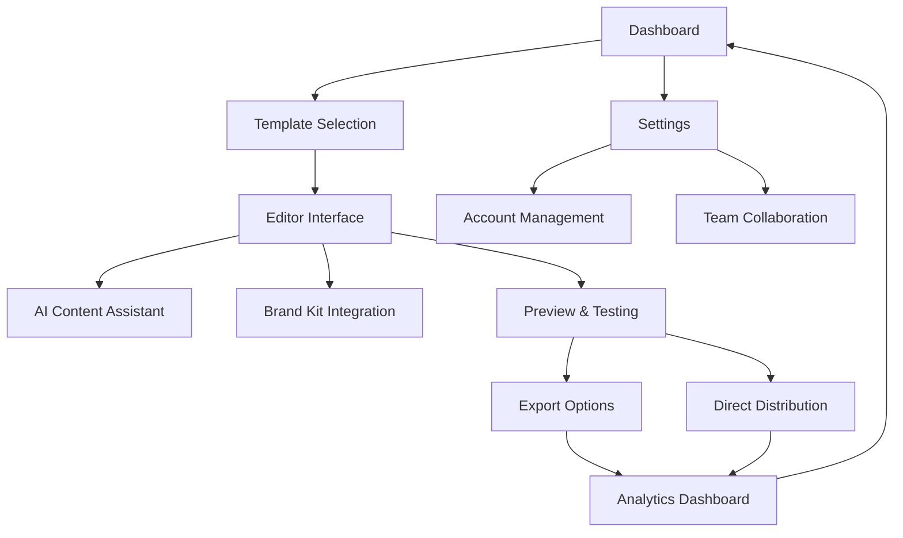

# Newsletter Creator Platform - Product Requirements Document

## 1. Product Overview
A comprehensive Newsletter Creator platform that enables users to design, customize, and distribute professional email newsletters through an intuitive drag-and-drop interface with AI-powered content assistance.

The platform solves the challenge of creating engaging email newsletters by providing professionally designed templates, AI-assisted content generation, and seamless distribution capabilities for businesses, marketers, and content creators.

Target market: Small to medium businesses, marketing agencies, content creators, and e-commerce companies seeking to improve their email marketing effectiveness.

## 2. Core Features

### 2.1 User Roles
| Role | Registration Method | Core Permissions |
|------|---------------------|------------------|
| Free User | Email registration | Access to basic templates, limited AI generations, basic export options |
| Premium User | Subscription upgrade | Full template library, unlimited AI assistance, advanced analytics, brand kit management |
| Team Admin | Team invitation | User management, shared brand assets, team collaboration features |

### 2.2 Feature Module
Our Newsletter Creator platform consists of the following main pages:
1. **Dashboard**: Template gallery, recent projects, quick actions, usage statistics
2. **Editor**: Drag-and-drop interface, content blocks, AI assistant, real-time preview
3. **Templates**: Categorized template library, search and filter, template customization
4. **Brand Kit**: Logo management, color palettes, font library, asset storage
5. **Preview & Test**: Desktop/mobile preview, device testing, email client compatibility
6. **Export & Distribute**: HTML/PDF/Image export, email service integration, distribution tracking
7. **Analytics**: Performance metrics, engagement tracking, subscriber insights
8. **Settings**: Account management, subscription details, team collaboration

### 2.3 Page Details
| Page Name | Module Name | Feature description |
|-----------|-------------|---------------------|
| Dashboard | Template Gallery | Display categorized templates (business, eCommerce, events) with search and filter capabilities |
| Dashboard | Recent Projects | Show user's recent newsletter projects with quick edit access and project status |
| Dashboard | Quick Actions | Provide shortcuts to create new newsletter, access AI assistant, view analytics |
| Editor | Drag-and-Drop Interface | Enable intuitive content arrangement with text blocks, images, buttons, dividers, social components |
| Editor | Content Blocks | Offer rich text formatting, image cropping/resizing, interactive CTAs, layout spacers |
| Editor | AI Assistant | Generate newsletter copy from prompts, suggest subject lines and preheader text |
| Editor | Real-time Preview | Show live desktop and mobile renderings with device-specific formatting checks |
| Templates | Template Library | Provide 130+ professionally designed templates categorized by purpose and industry |
| Templates | Template Customization | Allow layout modification, color scheme changes, content personalization |
| Brand Kit | Asset Management | Store company logos, watermarks, approved color palettes, brand fonts, standard imagery |
| Brand Kit | Brand Consistency | Ensure brand compliance across all newsletter designs and templates |
| Preview & Test | Multi-device Preview | Display newsletter appearance across desktop, tablet, and mobile devices |
| Preview & Test | Email Client Testing | Check compatibility with major email clients (Gmail, Outlook, Apple Mail) |
| Export & Distribute | Export Options | Generate HTML source code, PDF documents, and high-quality image files |
| Export & Distribute | Email Integration | Connect with major email service providers for direct distribution |
| Analytics | Performance Tracking | Monitor open rates, click-through rates, device statistics, subscriber engagement |
| Analytics | Engagement Metrics | Track interactive element performance, social sharing, video engagement |
| Settings | Account Management | Handle user profile, subscription management, billing information |
| Settings | Team Collaboration | Manage team members, shared assets, permission controls |

## 3. Core Process

**User Flow:**
1. User logs in and accesses the dashboard
2. Selects a template from the categorized library or starts from scratch
3. Uses the drag-and-drop editor to customize content and layout
4. Leverages AI assistant for content generation and optimization
5. Applies brand kit elements for consistency
6. Previews newsletter across different devices and email clients
7. Exports or directly distributes through integrated email services
8. Monitors performance through analytics dashboard

**Admin Flow:**
1. Team admin manages user permissions and shared brand assets
2. Oversees team collaboration and project sharing
3. Monitors team usage and subscription limits
4. Manages billing and subscription upgrades

## 4. User Interface Design

### 4.1 Design Style
- **Primary Colors**: #2563EB (Blue), #10B981 (Green), #F59E0B (Amber)
- **Secondary Colors**: #6B7280 (Gray), #EF4444 (Red), #8B5CF6 (Purple)
- **Button Style**: Rounded corners (8px radius), subtle shadows, hover animations
- **Typography**: Inter font family, 14px base size, clear hierarchy with 16px-24px headings
- **Layout Style**: Card-based design, clean sidebar navigation, spacious content areas
- **Icons**: Heroicons style, consistent 20px-24px sizing, outline and solid variants

### 4.2 Page Design Overview
| Page Name | Module Name | UI Elements |
|-----------|-------------|-------------|
| Dashboard | Template Gallery | Grid layout with hover effects, category filters, search bar with auto-complete |
| Dashboard | Recent Projects | Card-based layout with project thumbnails, status indicators, quick action buttons |
| Editor | Drag-and-Drop Interface | Left sidebar with content blocks, main canvas area, right panel for properties |
| Editor | AI Assistant | Floating panel with prompt input, suggestion cards, one-click apply buttons |
| Templates | Template Library | Masonry grid layout, category tabs, preview modal with customization options |
| Brand Kit | Asset Management | Upload zones, color picker widgets, font preview cards, organized asset grid |
| Preview & Test | Device Preview | Tabbed interface for device types, side-by-side comparison, zoom controls |
| Analytics | Performance Dashboard | Chart widgets, metric cards, date range selectors, export functionality |

### 4.3 Responsiveness
Desktop-first approach with mobile-adaptive design. Touch interaction optimization for tablet and mobile devices. Responsive breakpoints at 768px (tablet) and 480px (mobile) with collapsible navigation and optimized touch targets.